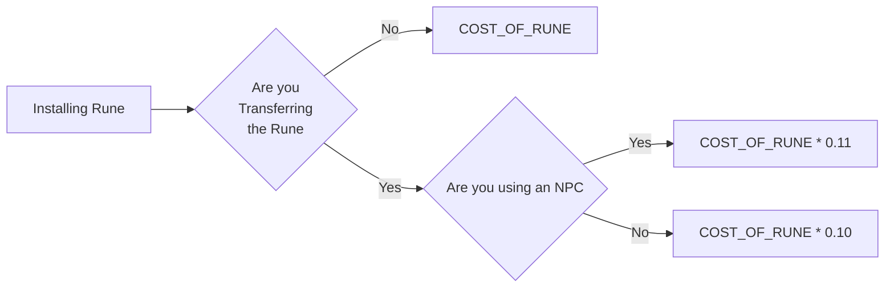
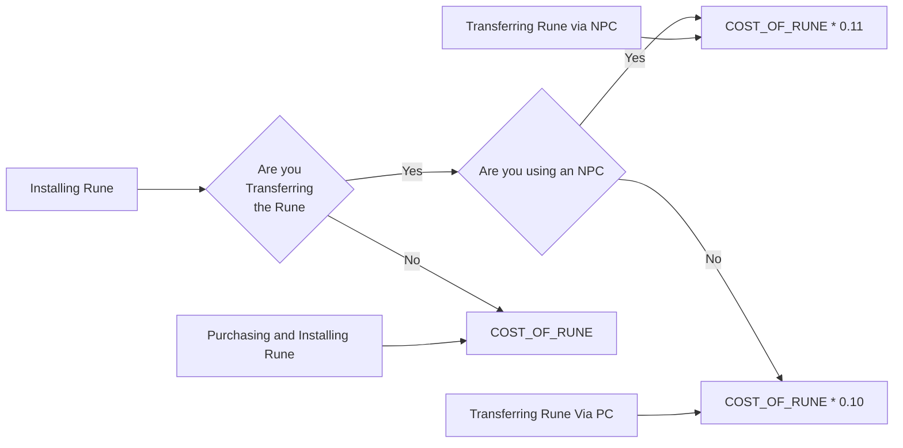

```mermaid

flowchart LR

%%NPC[Transferring Rune via NPC]
NPC_COST[COST_OF_RUNE * 0.11]

%%PC[Transferring Rune Via PC]
PC_COST[COST_OF_RUNE * 0.10]

%%UNE[Purchasing and Installing Rune]
RUNE_COST[COST_OF_RUNE]

State1[Installing Rune] --> Transfer{Are you <br> Transferring <br> the Rune}

Transfer-->|Yes|UsingNPC{Are you using an NPC}
UsingNPC-->|Yes|NPC_COST
UsingNPC-->|No|PC_COST
Transfer-->|No|RUNE_COST

%%NPC-->NPC_COST
%%PC-->PC_COST
%%RUNE-->RUNE_COST

```

```mermaid

flowchart LR

NPC[Transferring Rune via NPC]
NPC_COST[COST_OF_RUNE * 0.11]

PC[Transferring Rune Via PC]
PC_COST[COST_OF_RUNE * 0.10]

RUNE[Purchasing and Installing Rune]
RUNE_COST[COST_OF_RUNE]

State1[Installing Rune] --> Transfer{Are you <br> Transferring <br> the Rune}

Transfer-->|Yes|UsingNPC{Are you using an NPC}
UsingNPC-->|Yes|NPC_COST
UsingNPC-->|No|PC_COST
Transfer-->|No|RUNE_COST

NPC-->NPC_COST
PC-->PC_COST
RUNE-->RUNE_COST

```