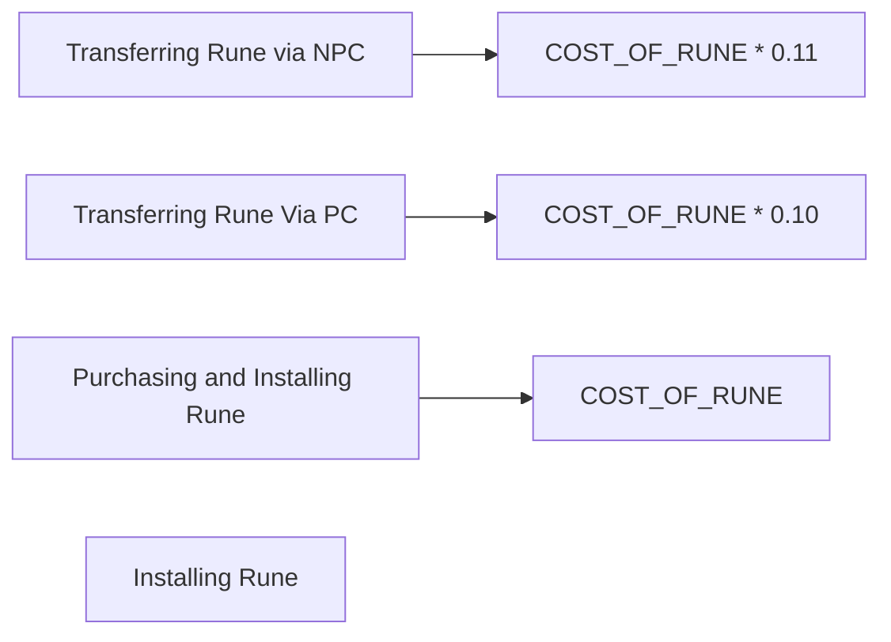

```mermaid

flowchart LR

NPC[Transferring Rune via NPC]
NPC_COST[COST_OF_RUNE * 0.11]

PC[Transferring Rune Via PC]
PC_COST[COST_OF_RUNE * 0.10]

RUNE[Purchasing and Installing Rune]
RUNE_COST[COST_OF_RUNE]

State1[Installing Rune]

NPC-->NPC_COST
PC-->PC_COST
RUNE-->RUNE_COST

```