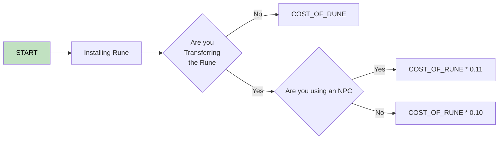
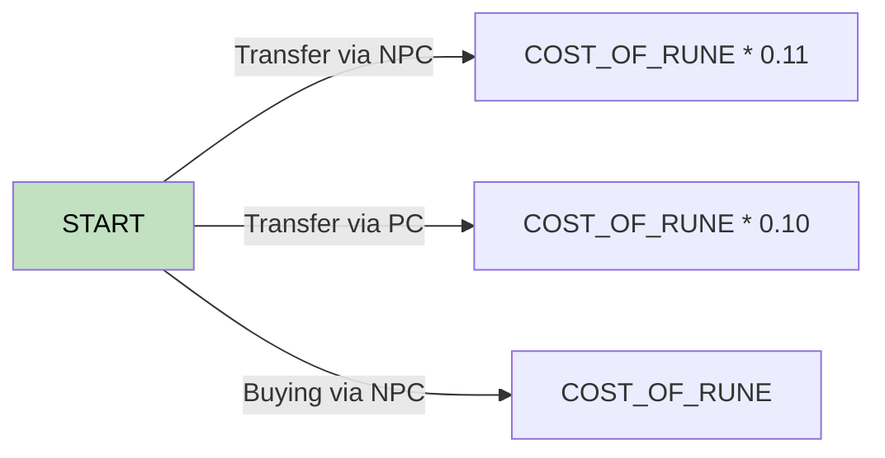

# Proper Flow Chart

```mermaid

flowchart LR

NPC_COST[COST_OF_RUNE * 0.11]
PC_COST[COST_OF_RUNE * 0.10]
RUNE_COST[COST_OF_RUNE]

style START fill:#C1E1C1,color:#000

START-->
State1[Installing Rune] --> Transfer{Are you <br> Transferring <br> the Rune}
Transfer-->|Yes|UsingNPC{Are you using an NPC}
UsingNPC-->|Yes|NPC_COST

UsingNPC-->|No|PC_COST

Transfer-->|No|RUNE_COST

```

# Simplified Stephen Proof Diagram

```mermaid

flowchart LR

%%NPC[Transferring Rune via NPC]
NPC_COST[COST_OF_RUNE * 0.11]

%%PC[Transferring Rune Via PC]
PC_COST[COST_OF_RUNE * 0.10]

%%RUNE[Purchasing and Installing Rune]
RUNE_COST[COST_OF_RUNE]

style START fill:#C1E1C1,color:#000

START-->|Transfer via NPC|NPC_COST
START-->|Transfer via PC|PC_COST
START-->|Buying via NPC|RUNE_COST

```