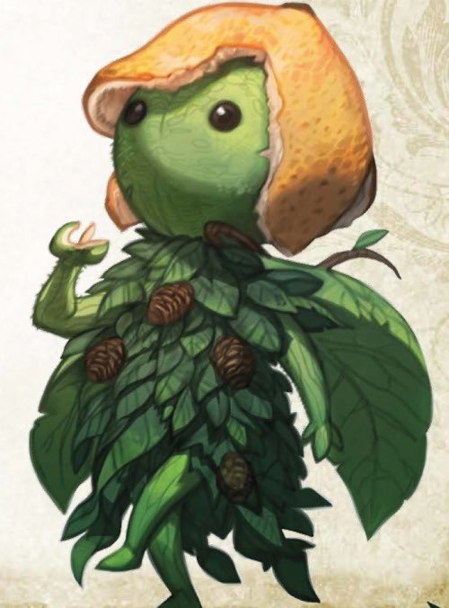
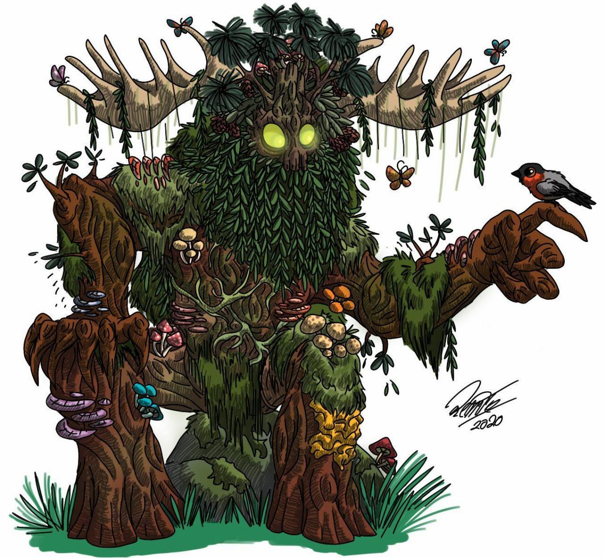

# Leafy
#TempestSunMages
# Backstory

Leafy is a leshy that was created by a druid named [[Amaris]] intended to help around the workshop for the druid circle. This was the first time this druid had created a Leshy and he didn't quite get the spell correct instead bringing to life a leshy capable of fully independent thought. Leafy while he began inhabiting his body did everything in his power to retain his sense of self and his past, while the knowledge of his past life is very imperfect as part of this he was able to summon his best friend from the material plane as an Eidolon. Through the shared burdon of manifesting themselves a bond was created between himself and his old friend from a previous life. Leafy spent time with the druid covenant, developing a sense of community and coming to understand the world he is now part of, well from the druid's eyes at least. His knowledge is incomplete, but his desire for adventure, spreading his knowledge and most importantly allowing his friend full independence from himself set him off on a path to a mages academy

# Fears

Leafy has a handful of fears:

1. His friend remaining fully dependent on Leafy without the ability to separate and become an independent entity
2. Inability to make friends and have adventures
3. Returning to earth (dying) without having an impact

# Driving force

1. Giving his best friend full independence from Leafy knowing full well it may result in his loss of magic
2. Making friends and spreading happiness
3. Defending his friends and family
4. Spreading his knowledge and love of nature
5. Adventures, having fun and ensuring others have fun with him

# Portrait

- Leafy

  

- Oaky -- Best Friend (Eidolon)

  
