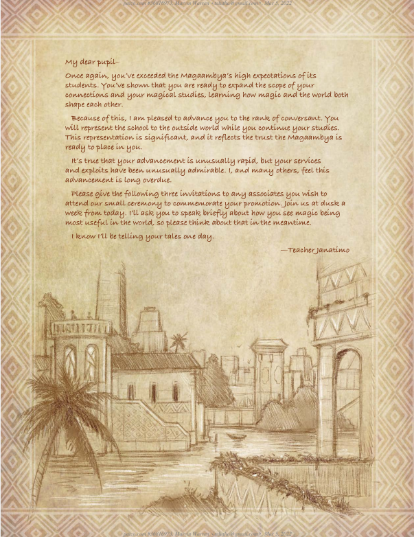

# Diary

- [Diary](#diary)
- [20220309](#20220309)
  - [OOC Notes](#ooc-notes)
  - [In character notes](#in-character-notes)
- [20220316](#20220316)
  - [OOC Notes](#ooc-notes-1)
  - [Entry](#entry)
- [20220330](#20220330)
  - [Entry](#entry-1)
- [20220406](#20220406)
  - [Entry](#entry-2)
    - [Fireday, Rova 9th 4721 AR](#fireday-rova-9th-4721-ar)
    - [Starday, Rova 10th 4721 AR](#starday-rova-10th-4721-ar)
- [20220427](#20220427)
  - [Entry](#entry-3)
    - [Starday, Rova 10th 4721 AR](#starday-rova-10th-4721-ar-1)
    - [Sunday, Rova 11th 4721 AR](#sunday-rova-11th-4721-ar)
- [20220427](#20220427-1)
  - [Entry](#entry-4)
    - [Moonday, Rova 12th 4721 AR](#moonday-rova-12th-4721-ar)
- [Missed Sessions](#missed-sessions)
  - [Missed notes...](#missed-notes)
  - [Branch](#branch)
- [20220622](#20220622)
  - [Entry](#entry-5)
- [20220628](#20220628)
  - [Entry](#entry-6)
    - [Arodus 30th](#arodus-30th)
- [20220706](#20220706)
  - [Entry](#entry-7)
    - [Arodus 30th 4722 AR Stone Ghost Combat Begins!!!](#arodus-30th-4722-ar-stone-ghost-combat-begins)
    - [Arodus 31st 4722 AR Griffon Combat Begins](#arodus-31st-4722-ar-griffon-combat-begins)
- [20220713](#20220713)
  - [Entry](#entry-8)
    - [Rova 15th, 4722 AR](#rova-15th-4722-ar)
  - [### Abadius 16th, 4723 AR](#-abadius-16th-4723-ar)
  - [### Abadius 18th, 4723 AR](#-abadius-18th-4723-ar)
- [20220803](#20220803)
  - [Entry](#entry-9)
  - [### Fireday, Abadius 19th, 4723 AR](#-fireday-abadius-19th-4723-ar)
    - [Starday, Abadius 20th 4723 AR](#starday-abadius-20th-4723-ar)
- [20220810](#20220810)
  - [Entry](#entry-10)
    - [Starday, Abadius 20th 4723 AR](#starday-abadius-20th-4723-ar-1)
- [20220817](#20220817)
  - [Entry](#entry-11)
    - [Sunday, Abadius 21st 4723 AR](#sunday-abadius-21st-4723-ar)
- [20220831](#20220831)
  - [Entry](#entry-12)
    - [Moonday, Calistril 5th, 4723 AR](#moonday-calistril-5th-4723-ar)
- [20220914](#20220914)
  - [Entry](#entry-13)

 

 

# 20220309

## OOC Notes

Character creation and discussion of character roles

Met with Teacher Ott who performed a series of questions to see how we thought and tried to learn a bit about who we are.
  

## In character notes

---

Everyone seems really fun, [[Hana]] called me a spirit and she's the only one who did... I like her

I was confused by [[Rogar]] he says he hasn't accomplished much, but his family has? I don't understand the difference, aren't they the same? I like him.

Whoa symbols just appeared out of thin air and we were instructed to choose one! I was very torn between the Balanced Scales and the Hourglass
  

# 20220316

## OOC Notes

---

[[NPC's/Students/Esi Djana]] is a fellow student showing us around. She seems very knowledgeable.

[[NPC's/Students/Chizire]] seems like a slacker who makes moonshine in his room. Called the moonshine wine at first and doesn't seem to know or care to know the difference. He's in the cascade bearers

[[NPC's/Students/Ignaci Canterells]] introduced himself and seems very well mannered.

[[NPC's/Students/Anchor Root]] is a very cautious person and quiet. Seems nervous when it comes to making friends and very much lacking in confidence.
  

## Entry

---

We have arrived at the academy and walked into the entryway, lots of people have greeted us so far, people here are so friendly. Chizire doesn't know the difference between moonshine and wine. I really like everyone so far they're all so friendly.

Esi knew I was a leshy, that's a magic school for you, they're all so proper.

I found a hatch

Found a black and white drawing of nethys. Quote on it: "All-Seeing Solutions: Pay in Light, Let the Darkness Show Wisdom!"

We were ambushed by some spell-work that thought we were intruders, they were just paper frogs. They can be re-united with the earth now.

It's a new day, I was fetched rather late. I rise with the sun. We have to look for some endangered Ojofiri Chickens or eggs. Need at least 4, at least one male and one female.

Ojofiri Chickens are described as

> small fowl with white faces, dark blue feathers, and lavender combs; chicks should have dark blue feathers with a white underbelly.
>
> The gather information activity was successful, Seydou may have what we need.

 

# 20220330

## Entry

---

Still cold and dreary now, I was hoping it would burn off no time like the present for the market though! I think. We were able to find the chick's! Luckily there was male and a female, they're very fragile though. With help I was able to keep them very cuddled up and warm for the trip back because it was rainy. We were asked to remove some pugwampi gnolls from a storeroom in the town. The pugwampi have an obsessive love for gnolls, we were able to recruit Anchor Root to help us out as she's a gnoll. I got to meet anchor root, I'm supposed to treat her like the chicks, guess that means my quiet voice.

I finally got to meet Anchor Root, another friend, I like her.

They work for a big grimlin (Kershkin) and the big grimlin works for a scary ghost. The scary ghost and Kershkin are up to something that will be bad for the stuck up wizards
  

# 20220406

## Entry

---

### Fireday, Rova 9th 4721 AR

We were approached by [[Ignaci Canterells]] and [[Strands of Glowing Dawn]] (Tzeniwe). We were given elephant birds to ride, even for Oaky! Strands-of-glowing-dawn (Tzeniwe) seems to have set this up, that’s a mouthful to say. Tzeniwe said they represent the emerald bows.

#EmeraldBoughs

Rogar has a mean side, he was scary when he told the mean lady that she needed to return the lamp. Everyone around was also not happy with what happened.

### Starday, Rova 10th 4721 AR

We have to collect a lot of things for Anchor Root.
  

# 20220427

## Entry

---

### Starday, Rova 10th 4721 AR

We have to collect a lot of things for Anchor Root.

I was able to help Noct with his disease, I think anyway.

### Sunday, Rova 11th 4721 AR

We met Okoro Obiyo and Noxolo who are part of the Unjari
  

# 20220427

## Entry

---

### Moonday, Rova 12th 4721 AR

I really hit it off with Ignaci he seems to be warming up to me a little bit, especially after the Karen incident. I got to meet so many new people and learn about how they worship, it was my dream! I learned so much about Nantambu while interacting with the citizens and worshipers. Not only that but I heard so many fascinating things about the surrounding area and even far reaching areas, I cannot wait to explore these other areas. I'm also looking forward to learning even more about Ignaci

During this four month interval (Rova 12th - Kuthona 12th) Leafy started a compost pile for fertilizer for the flours he's going to plant in spring.
  

# Missed Sessions

## Missed notes...

I missed a ton of notes here...

## Branch

Leafy stuck with his primary focuses of Emerald Bows (primary) and Tempest-Sun Mages (secondary). He ultimately wants to make more friends and continue spreading happiness. His goal to adventure and defend his friends and family drives him to also be interested in the Tempest-Sun mages.

He was able to progress his main and sub branches a bit, but sometimes got a little too focused on his garden and arguing with the grounds keeper about how his plants helped balance the ecosystem and were critical to his mental health.
  

# 20220622

## Entry

---

I got to the party a little late... [[Hana]], [[Rogar]], [[Ephret]] and [[Noct]] had already arrived. When I got here they were a little hurt :(. We had to spend a little time healing up and eventually we ran into our other friends [[Ignaci Canterells]] was hurt pretty bad...

We countered an enemy with a giant fly. She was being really mean to it knocking it down and whipping it...

- [[Giant Tsetse Fly]]
- [[Urbel]]

Well we managed to kill the giant fly, that was really rough... Unfortunately there is still the main guy left and I've used all my spells up... Hopefully my friends are in better shape than me.
  

# 20220628

## Entry

---

### Arodus 30th

Rogar almost went down, barely kept him up with my Battle Medicine...

We were able to beat them, but it took everything I had.

- [[Giant Tsetse Fly]]
- [[Urbel]]

We made our way to the north, we encountered a [[Gray Ooze]] that for now we're just avoiding, and also nearby some [[Brown Mold]] that reacts to heat. Rogar was able to fully remove it, but it did hurt a little...

A little beyond the brown mold we ran into some more creatures, and they sound mean... Oh another [[Giant Mining Bees]], ahead this is going to be rough. Also appear to be more of the [[Gnagrif]] grimlin guys, not sure what they are... They hurt so bad last time...

We're making our way to the [[Stone Ghost]] "office". Three masks and three cloaks are affixed to the south wall of this claustrophobic cave, as though in mockery of people, with arms extended to the sides. All look colorful, but dirty and bloodstained. One of the masks depicts a stern antelope, another a kindly hare, and the last a smiling warthog.

The masks look like masks from the magambia, they're [[Stone Ghost]] trophy's of other magambian's that have been here... This seems pretty ominous. One mask has magical properties. One of the masks has the ability to double healing when rolled, the other two Hanah put them in her backpack.

We found [[Stone Ghost]]s' room, just as I was feeling safe the ghost appeared. A voice rings out from the walls and it says "Attack these interloper's", he comes out of the wall and walked directly at [[Rogar]] just like a ghost.
  

# 20220706

## Entry

---

### Arodus 30th 4722 AR Stone Ghost Combat Begins!!!

Well [[Stone Ghost]] wasn't so bad... Hana was able to piece together all the notes, they have really complete maps of the tunnels. Some of the older notes references [[Uduak Basni]] (maybe Stone Ghost's Name) and he's very happy about presence of the insects. He was working the worker bee's to death (insects) which was a bit of a distraction for the grimlins who he is also working to death. In addition there are details of attacks the first of which was the attack on our ceremony with each getting successively worse.

Whoa there are so many insects of varying sizes. [[Teacher Ulaala]] is heading up the investigation and categorization of the insects.

### Arodus 31st 4722 AR Griffon Combat Begins

[[Teacher Ot]] is asking us for what happened during our adventures in the caves. Rogar keeps a book of deed's that he was able to bring up with [[Teacher Ot]] in addition Hana releayed what all she found. [[Teacher Ot]] is using some crazy magic to repair all the documents over the course of 10 minutes it looks almost pristine now, WOW... [[Hana]], [[Ephret]] and [[Rogar]] was able to get it almost perfectly re-assemble the book.

[[Teacher Ot]] says they found that the [[Stone Ghost]] likely wasn't the cause of the insects to come along, but there is some ongoing pervasive psychic call to bring them here. The grimlins, pests and other creatures seem to be responding to this call as well. Generally they are experiencing a sense of longing that they must come to the [[Magaambya]]. The signal doesn't appear to be localized or strong, it's just present. [[Teacher Ulaala]] has been strangely silent regarding what is drawing all the insects to the campus. Either she has some ideas which are dangerous but she's unwilling to share them or she doesn't have idea's which would be stranger still. [[Teacher Ot]] transferred the enchantment from the [[Mask of Mercy]] into my [[Mask of Hope]], it will help me to heal and protect the others. [[Teacher Ot]] said this is an uncommon occurrence

While in discussion with [[Teacher Ot]] we were redirected to some [[Anadi]] that want to become students at the [[Magaambya]]. In the middle of discussions with them just when [[Teacher Ot]] was going to have us pipe in [[Griffon]]'s swooped in to attack the [[Anadi]] one went down before I was even able to do anything.

# 20220713

## Entry

---

### Rova 15th, 4722 AR

OOC -- Roughly 2 weeks in game has passed

[[Occoro]] said [[Janatimo]] has come to the academy to teach, he must have amazing stories to tell. I have been told my stories leave a little to be desired, and that it adds to my charm!

[[Janatimo]] summoned us by leaving a note on our pillow. He asked us for straightforwards and outlandish answers to various questions regarding recent events.

We were given tasks to investigate in our spare time, our studies take precedent

1. Find out what brought the #Anadi to the school
2. Find out where the #Griffon's came from

He provided us with 3 items for spending time with him.

1. Crown of the Companion
   > Stories tell of a forgotten king who once loved his subjects so much he was willing to give his own life energy for them. Whether true or not, this majesticwooden crown bears elaborate carvings depicting that tale. It's ringed with images of the same kingly figure giving more and more of himself to a throng of needy subjects. While wearing it, you gain a +1 item bonus to Diplomacy checks.
2. Primal Scroll Case of Simplicity
   > The four different types of scroll cases of simplicity often bear adornments appropriate to their magical tradition, such as angelic wings or otherworldly lettering. On the inside, intricate runic diagrams spiral out to surround the scroll stored within. A scroll placed within the case can be converted into energy to cast consistently useful spells depending on its type. You must be able to cast spells of a given tradition to use a scroll case of simplicity of a corresponding type.
3. Warrior's Training Ring
   > This ring is utilitarian in design-indicating its martial use. Its band is decorated only with a simple, sharp-edged sculpture on the band's center. While wearing this ring, you add your level to your attack rolls with all weapons with which you are untrained.

### Abadius 16th, 4723 AR
---
OOC -- had 4 months of studying

### Abadius 18th, 4723 AR
---
Met with [[Ignaci Canterells]], [[Noxolo]] and [[Strands of Glowing Dawn]] at their sewing day and was able to bring up the #Anadi in relatively normal conversation. The scarf is only able to be made using #Anadi techniques.

[[Reflected-Upon-Gossamer-Strands]] or Goss

[[Barest-Threads-Billowing Maztachia]] -- went down

[[Droplets-Hanging-Gently Savanakin]] -- Died

We finally managed to approach the Anadi to learn more about them. They seem very kind, while in the midst of discussion and giving them the pouch some statues animated and attacked us. Maybe the [[Griffon]]'s were targetting us all along.

# 20220803

## Entry

---

### Fireday, Abadius 19th, 4723 AR
--- 
Well out of the kettle and into the fire... After barely getting through the fight with the statues we investigated some sounds and two very, very large snakes appeared to attack us. 

It was almost the end of me

### Starday, Abadius 20th 4723 AR

We returned to Hababe Building to investigate. When I went to put my ear up to the door some snakes came out and cursed Noct and me, guess I need to get that removed now. Well after the curse was put on me we tried to see if the trap would strike twice. The trap didn't strike twice, but I could hear mumbling through the door [[Oyo]] and [[Mtembe]] were inside gambling

They referenced [[Teacher Orwallu]] and [[Teacher Harrou]] I haven't heard of them, later Ephret explained that he knew the two teachers no longer teach at the [[Magaambya]] Rogar vehemently argued that he's been in their class.

[[Ephret]] was doing a fantastic job of fishing for information, I think he knew they were lieing... I guess I was too obvious that I knew they were lying? I need some lessons from [[Ephret]] on how to get information from people when you know they're lying.

After going through the room finding and unlocking a #trapdoor (it took a full hour) we entered the room to the north and a bunch of wood turned into another [[Golemn]].

# 20220810

## Entry

---

### Starday, Abadius 20th 4723 AR

We were able to defeat the [[Golemn]] he seemed weak to fire and unsurprisingly strong against lightning. The statue.

[[Teacher Janatimo]] said the [[Tian Xia]]n coffee table is perfectly paired with his coffee cups. This is something you learn only through extensive journeying. I cannot wait for my first adventure to learn such things!

# 20220817

## Entry

### Sunday, Abadius 21st 4723 AR

We monitored the entrance into the cave system for any activity, but nothing appeared. To make sure our new friends [[Reflected-Upon-Gossamer-Strands]] and [[Barest-Threads-Billowing Maztachia]] are safe I grew a tree to cover the hole. Now I can rest easy that our friends who are moving into the old building are safe.

# 20220831

## Entry

### Moonday, Calistril 5th, 4723 AR

Teacher [[Janatimo]] has advanced us to rank of #conversant. We have to give a talk about how 

# 20220914

## Entry

We have mostly closed out the investigation, Abeyo ran out of the city we were unfortunately unable to stop him. Bamidele turned himself in for wrongdoing.

Amaechi has put in a request for help, it has been left for us.

