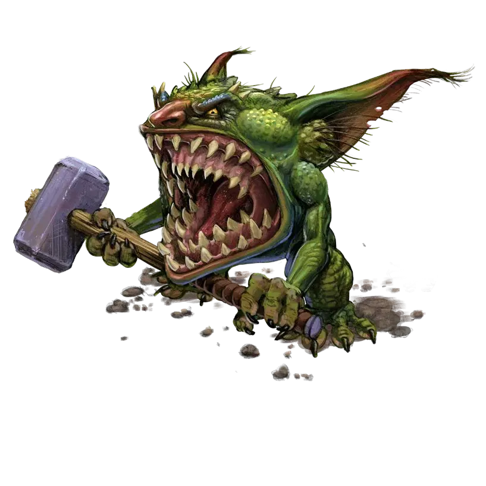

# Gnagrif

Squat, surly, and perpetually covered in wet mud, gnagrifs are gremlins that infest and destroy homes. They possess sharklike faces and two sets of jaws, allowing them to open their mouths 180 degrees and clamp onto flat rocks and walls. They delight in keeping their presence hidden, chewing holes into walls and foundations that weaken structures but don't bring them down until their inhabitants slam their doors too hard or step in the wrong place. Soon as the unwitting victims spring the trap, the building collapses around them.

# Attack and Defense Stats

## Resistances

No resistances

## Weaknesses
