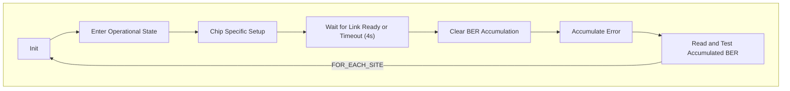
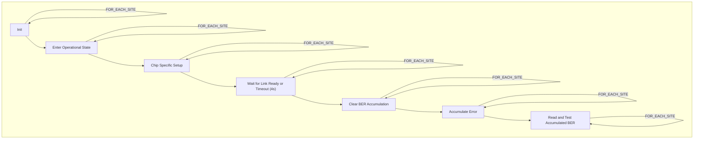

# Test Flow and TTM Comparison PS1600 vs Link Scale

# General Notes

Note Link-Scale is capable of a 20MHz clock with an effective throughput of 15Mbps. The throughput does not take into account any overhead of the protocol and is the wire throughput.

  

# Today's Bring-up Flow and Test Flow

Code must be converted from Python to C++ for ATE while still utilizing single-site API's generated by Design. The API's are sufficiently complicated that conversion is not necessarily feasible. The version described below is what would be released to production for decent MSE. The initial version would likely just serialize everything in one method, the below version has the Wait for Link Ready parallelized. The final phase would be to vectorize everything shaving off what the last inefficiencies, this must be done per firmware release, is difficult and likely will take multiple iterations to get delays perfected.

 

## Non Optimized / Day 1 code

 

## Optimized Code

This code would be optimized once the test program is stable and we're in the TTR phase. A deep correlation is required at this step to make sure we didn't accidently break something. Additionally if the program wasn't written with this in mind from the beginning, there is a chance a bug could be introduced at this step.

  

# Proposed flow using Link Scale

The code does not need to go through any conversion step, it will work natively on Link Scale. Furthermore the code can be validated on the bench, even the controller (FT2232H chip) can be used to control an EVK removing more potential issues.

## For below example, quad site will be assumed

This code is the same whether 1 or 4 sites, there is no need to rework any code. What the below diagram is showing is we've kicked off the test case 4 times so each one runs in parallel. This means we write single site code and it can run in parallel efficiently. Link Scale is about 14x faster than PS1600 (100uS vs 1.4mS) per transaction, however a bulk of our time is spent waiting on the DUT. This fully parallelizes waits including nested or deeply buried waits we previously had to Vectorize.

The savings will not be as good as Vectorizing the entire flow, but we can get the savings much earlier in the process with less headache and correlation required. Additionally it enables the use of Python or C++ for the test cases with little to no difference in overhead.

```mermaid
flowchart TD
    INIT1[Init]
    ENTER_OP1[Enter Operational State]
    CHIP_SPEC1[Chip Specific Setup]
    WAIT_LINK1["Wait for Link Ready or Timeout (4s)"]
    CLEAR1[Clear BER Accumulation]
    ACCUMULATE1[Accumulate Error]
    TEST1[Read and Test Accumulated BER]

    INIT2[Init]
    ENTER_OP2[Enter Operational State]
    CHIP_SPEC2[Chip Specific Setup]
    WAIT_LINK2["Wait for Link Ready or Timeout (4s)"]
    CLEAR2[Clear BER Accumulation]
    ACCUMULATE2[Accumulate Error]
    TEST2[Read and Test Accumulated BER]

    INIT3[Init]
    ENTER_OP3[Enter Operational State]
    CHIP_SPEC3[Chip Specific Setup]
    WAIT_LINK3["Wait for Link Ready or Timeout (4s)"]
    CLEAR3[Clear BER Accumulation]
    ACCUMULATE3[Accumulate Error]
    TEST3[Read and Test Accumulated BER]

    INIT4[Init]
    ENTER_OP4[Enter Operational State]
    CHIP_SPEC4[Chip Specific Setup]
    WAIT_LINK4["Wait for Link Ready or Timeout (4s)"]
    CLEAR4[Clear BER Accumulation]
    ACCUMULATE4[Accumulate Error]
    TEST4[Read and Test Accumulated BER]

    RUN_TESTCASE["Link Scale Run BER Test Case (FDAT)"]
    RETURN_CONTROL[Return Control to Host PC]

    RUN_TESTCASE --> |Branch| SITE_1
    RUN_TESTCASE --> |Branch| SITE_2
    RUN_TESTCASE --> |Branch| SITE_3
    RUN_TESTCASE --> |Branch| SITE_4

    SITE_1 --> |Join| RETURN_CONTROL
    SITE_2 --> |Join| RETURN_CONTROL
    SITE_3 --> |Join| RETURN_CONTROL
    SITE_4 --> |Join| RETURN_CONTROL

    subgraph SITE_1[Site 1]
        INIT1 --> ENTER_OP1
        ENTER_OP1 --> CHIP_SPEC1
        CHIP_SPEC1 --> WAIT_LINK1
        WAIT_LINK1 --> CLEAR1
        CLEAR1 --> ACCUMULATE1
        ACCUMULATE1 --> TEST1
    end

    subgraph SITE_2[Site 2]
        INIT2 --> ENTER_OP2
        ENTER_OP2 --> CHIP_SPEC2
        CHIP_SPEC2 --> WAIT_LINK2
        WAIT_LINK2 --> CLEAR2
        CLEAR2 --> ACCUMULATE2
        ACCUMULATE2 --> TEST2
    end

    subgraph SITE_3[SITE 3]
        INIT3 --> ENTER_OP3
        ENTER_OP3 --> CHIP_SPEC3
        CHIP_SPEC3 --> WAIT_LINK3
        WAIT_LINK3 --> CLEAR3
        CLEAR3 --> ACCUMULATE3
        ACCUMULATE3 --> TEST3
    end

    subgraph SITE_4[Site 4]
        INIT4 --> ENTER_OP4
        ENTER_OP4 --> CHIP_SPEC4
        CHIP_SPEC4 --> WAIT_LINK4
        WAIT_LINK4 --> CLEAR4
        CLEAR4 --> ACCUMULATE4
        ACCUMULATE4 --> TEST4
    end

```

