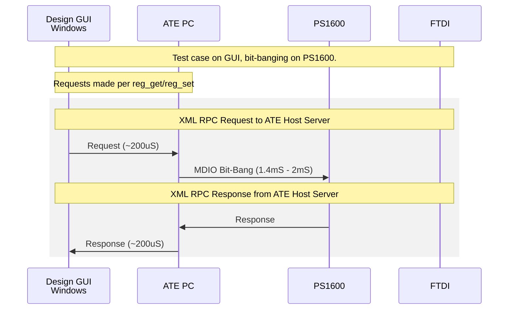
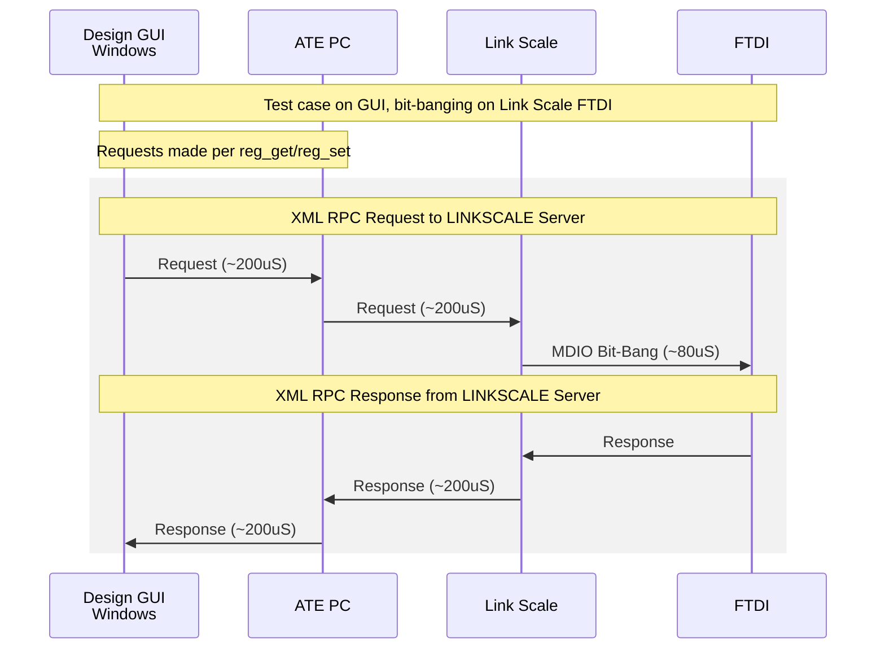
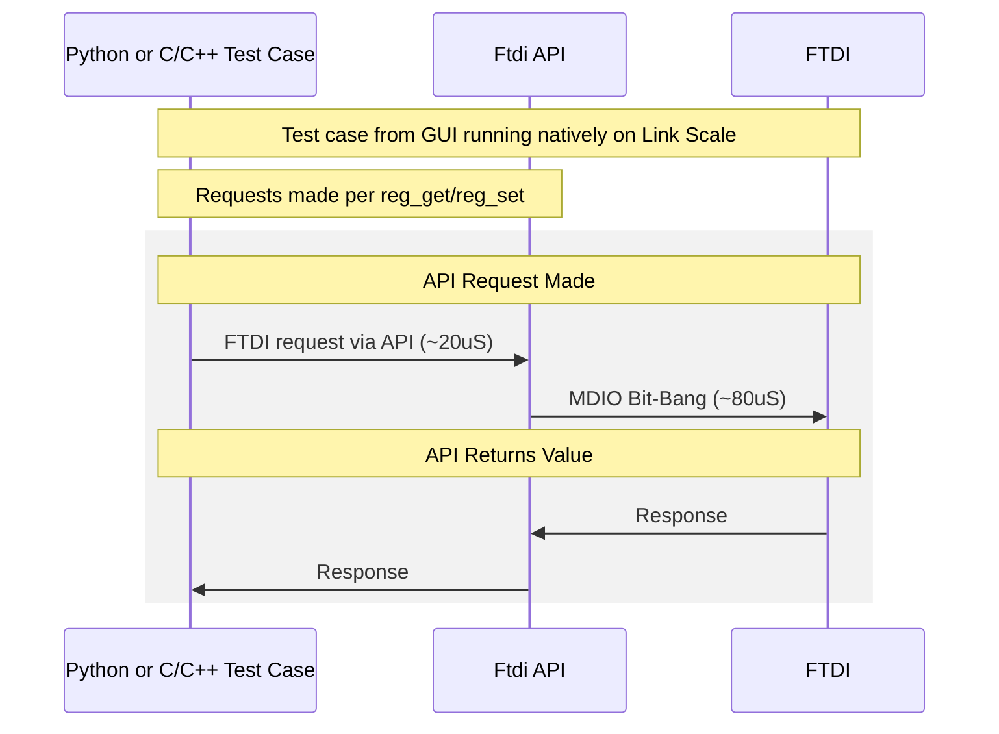

# ATE Control from Bench GUI, PS1600 vs Link Scale

This gives an overview of the high level architecture for controlling ATE from Bench EVK Software. The architecture does not fundamentally change, but throughput is increased.

  

# General Notes

Note Link-Scale is capable of a 20MHz clock with an effective throughput of 15Mbps. The throughput does not take into account any overhead of the protocol and is the wire throughput.

The PS1600https://marvell.zoom.us/j/98134566431?pwd=YWJHb2lEaUZwakZtc0o0UXlNakZsUT09 is implemented in a way that a reg_set/reg_get can be performed sequentially. The XMLRPC enables support for \*\_list which populates a list of addresses and data for performing the operation, the PS1600 implementation will do this sequentially which means there isn't a savings or throughput increase. Link Scale's architecture makes support of variable length transactions much more straightforwards, so a throughput bump is experienced by these commands.

  

# Today's Flow using XML-RPC ~1.8mS to 2.4mS per reg_get/reg_set

  

# XMLRPC Flow with LinkScale ~880uS per reg_get/reg_set

  

# Native API Flow on LinkScale ~100uS per reg_get/reg_set

Code is running natively on Link-Scale.

  
