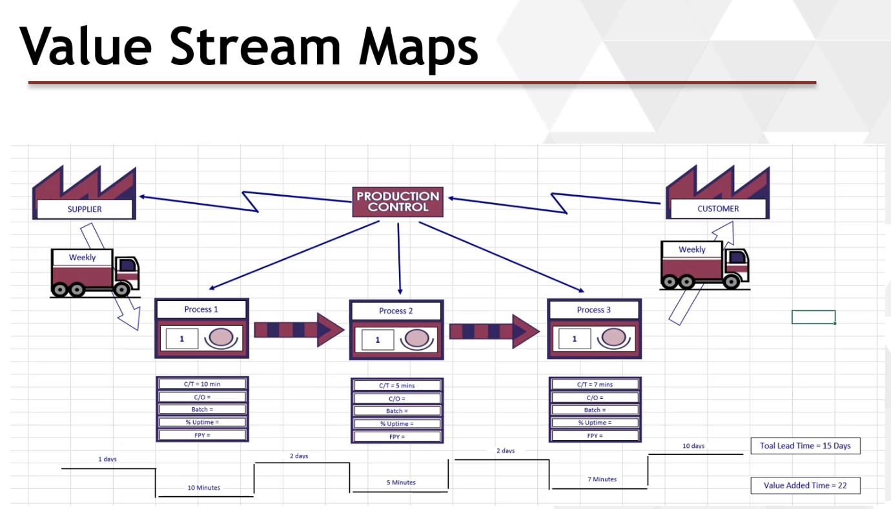
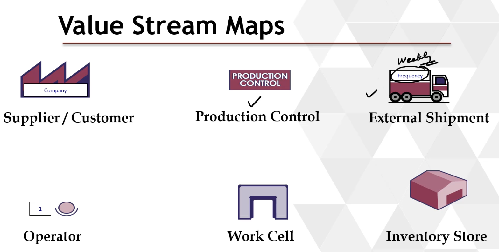
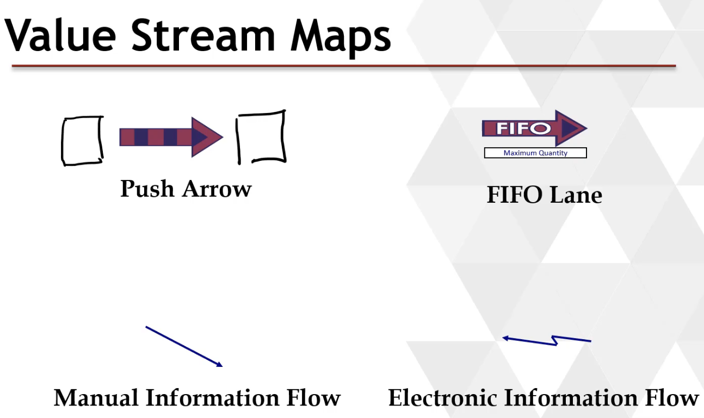
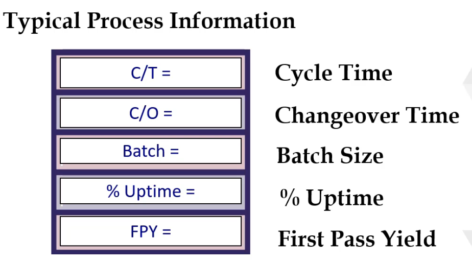
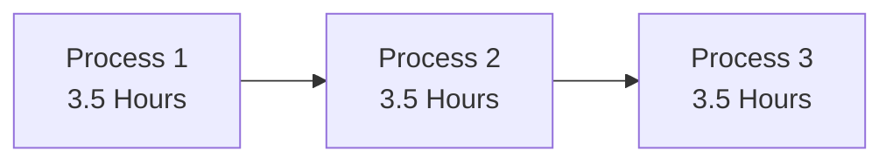
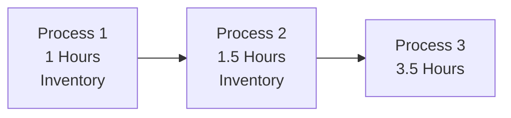
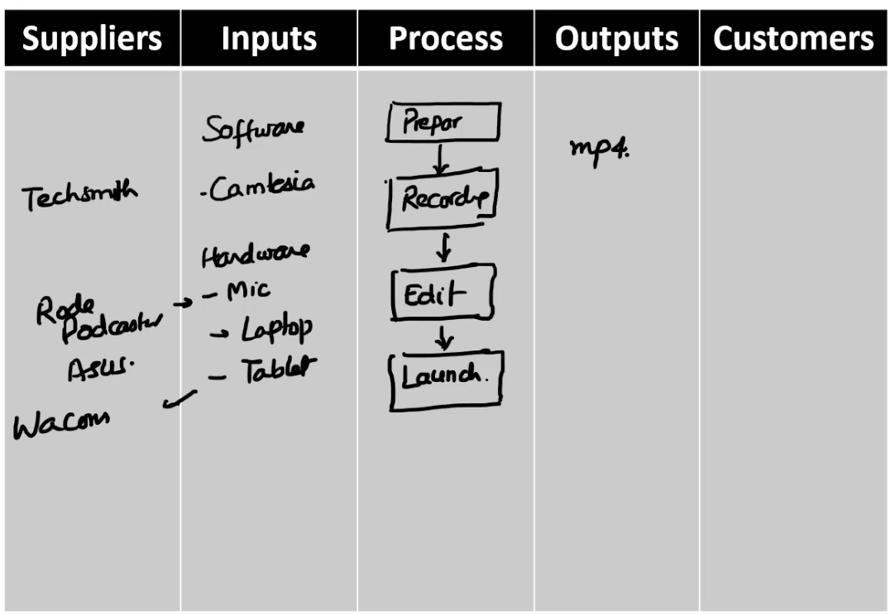
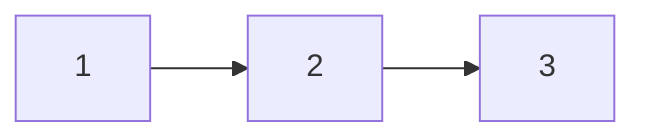
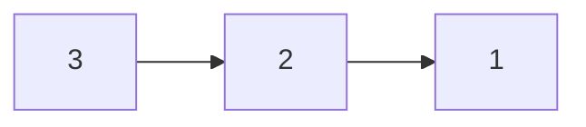
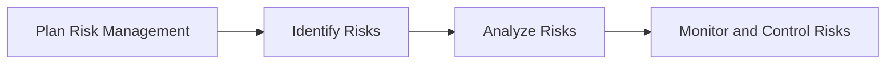

# Green Belt Training Course notes

site: https://marvell.udemy.com/course/six-sigma-green-belt-with-minitab/learn/lecture/13014300#overview

# Chapters 1-4: Value of #SixSigma

## 1: Introduction

Course is based on the ASQ Green Belt Body of Knowledge. 

6 main sections, Overview then #DMAIC
1. Overview
2. #Define
3. #Measure
4. #Analyze
5. #Improve
6. #Control

1. Overview Six Sigma and the Organization
   1. Six Sigma and Organizational Goals
   2. Lean principles in the Organization
   3. Design for Six Sigma Methodologies #DFSS

2. Six Sigma and Organizational Goals
   1. Value of Six Sigma
   2. Organizational Goals and Six Sigma Projects
   3. Organizational Drivers

---

## 2: Benefits of Six Sigma

- Generates sustained success
  - Project based approach
  - Take project and improve upon it
  - The goal succeeds and shouldn't be lost, should get saving year after year
- Project selection tied to organizational strategy
  - Customer Focused
  - Profits
- Project outcomes / benefits are tied to financial reporting system
- Full-time Black Belts in a rigorous project-oriented method
- Recognition and reward system established to provide motivation

### Organizations which achieved success

- Motorola - Created Six Sigma
  - 5-Fold growth in Sales
  - Profits climbing by 20% PA
  - Cumulative savings of $14 billion over 11 years
- General Electric
  - $2 billion savings in just 3 years
- Bechtel Corporation
  - $200 million savings with $30 million investment

---

## 3: Six Sigma Philosophy

Four important philosphies
1. Know what is important to customer (#CTQ)
2. Reduce Defects (#DPMO)
3. Centre Around Target (#Mean)
4. Reduce Variation (#Standard-Deviation)

### Simple Example

Producing a shaft that is 100mm long. In an ideal world it's exactly 100mm, in reality we see 101mm, 98mm, 103mm. Assume the length is very important to the customer #CTQ, any variation causes slop. To reduce #DPMO we need to ensure as many shafts as possible will fit into the slot it's designed for. To do this first we make sure the #Mean of the shafts are 100mm, so the center of the Bell Curve will be 100mm. If we can Reduce variation by increasing the slope of the bell curve this would help with other objectives, maybe we target 99mm to 101mm instead of 95mm to 105mm.

---

## 4: Evolution of Six Sigma

No magic happened in 1986, it was just formalized.

- 1987 Motorola Develops Six Sigma
  - Control charts by Walter Shewhart in 1924
  - Juran's project by project improvement
  - Deming's philosophy of process control, variation and #PDCA
    - #PDCA was translated into #DMAIC
  - Ishikawa's fishbone diagram for RCA
  - Process Capability (Cp, Cpk) > #DPMO
    - Important concept in #Measurement Phase
  - Design of Experiments - work of RA Fisher in 1920 - 1930
    - In Control Phase

# Chapter 5-6: Organizational Goals and Six Sigma Projects

## 5: Selecting a Project

Whatever #SixSigma project we do needs to be aligned with the Organizational goal.  i.e. goal could be profits, user count etc... No point in a project that isn't aligned with organizational goal.

1. How do we select a project and aligning it to organizational goal
2. How do we improve the process (Input --> Output with feedback)

### Six Sigma Project Selection

- External Sources:
  - Voice of Customer
    - What are we falling short of meeting the customer needs?
    - What are the new needs of customers?
  - Voice of Market
    - What are market trends and are we ready to adapt
  - Voice of Competitors
    - What are we behind our competitors?
- Internal Sources
  - Voice of Process
    - Where are the defects, repairs and reworks?
    - What are the major delays?
    - What are the major wastes?
  - Voice of Employee
    - What concerns or ideas have employees or manager raised?

#### Six Sigma Project Selection

- Sweet Fruit - Black Belt
  - Design for Repeatability
  - Requires more effort
- Bulk of Fruit - Green belt upper limit
  - Process Optimization
  - Requires more analysis or work.
- Low Hanging Fruit - Green belt typical limit
  - Seven Basic Tools
  - Requires little analysis / work.  Within 1 or 2 person of effort
- Ground Fruit
  - Logic and Intuition
  - Very basic and can be quickly done

### Qualifications of a #SixSigma Project

1. There is a gap between current and desired / needed performance
2. The cause of the problem is not clearly understood
3. The solution is not pre-determined, nor is the optimal solution apparent

## 6: Process

#SixSigma refers to improving.

### What is a process

- In lecturers organization, the act of putting out content / training is a process
  1. Making slides and research
  2. Record lecture
  3. Edit recorded lecture
  4. Publish/Sell the class

- Process is an Input --> Output
  - Input in this case would be the recording process
  - Output would be an mp4
  - Feedback would be checking to make sure the mp4 is okay, for instance the microphone had an issue

# 7: 1A3 Organizational Drivers and Metrics

Some Key Drivers may Include

1. Profit
2. Market Share
3. Customer Satisfaction
4. Efficiency
5. Product Differentiation

Business Key Drivers

Focus on limited numbers of drivers

- Those that are measurable
- Show current performance of the organization
- compared with competitors or benchmarks
- provide actionale information

Example of Profit Key Metric

- Cost of production
- Average Sale Price
- Profit Margins
- Return on Investment

Balanced scorecard will give you the big picture
  View the organization from four perspectives and develop Objective, measures (#KPI - Key Performance Indicators), targets, initiatives (actions) relative to each of these points of view:
  - Financial
  - Customer/Stakeholder
  - Internal Process
  - Learning and Growth
  
  

# Chapter 8-9: ASQ CSSGB 2022 Updates - SMART Goals & KPI's

## 8: SMART Goals

- Assure that the #SixSigma project aligns with organization's vision and mission
  - Profits
  - Market Share
  - Customer Acquisition
  - Patient Safety
  - Client Satisfaction
  - ...

#SMART Goals
- S - Specific
- M - Measurable
- A - Achievable
- R - Realistic
- T - Time-bound
  - Example: To reduce the weld repair rate from 4.5% to 0.5% by end of December 2016.

## 9: #KPI's

#KPI - Key Performance Indicators important or key indicators for your organization or your project.
- Metrics to measure performance
- Commonly used performance measures for outsiders are financial
- Internal metrics include performance levels
  - Process yield
  - Defect rate
  - Average time to answer a call
  - Schedule
  - ...

Balanced Scorecard
- By Robert S. Kaplan and Davit P. Norton
- Four perspectives
  - Financial (Costs, Savings, Productivity)
  - Customer (Delivery Time, Quality, Service)
  - Internal Business Processes (Defect Rate, QMS, Inf. System)
  - Learning and Growth (Training, Continual Improvement)

Leading vs Lagging #KPI's
- Lagging measures are easy to measure
- Lagging measures are post-event (output)
- Leading are predictive measures (inputs)
- Leading indicators are not guarunteed and are difficult to decide which one to select
- Mix of both leading and lagging is good

# Chapter 10-17: 1B1 Lean Concepts - Introduction, Philosphy, Theory of Constraints (#TOC), Value Stream Mapping (#VSM), Takt Time and Just In Time (#JIT), Gemba, Spaghatti Diagram

## 10: Introduction

#LEAN - Waste Reduction
#SixSigma - Consistency

Benefits of #LEAN
- Reduces Waste
- Improved Quality / Customer Satisfaction
- Reduced Inventory
- Reduced Cycle Time
- Flexible Manufacturing
- Safe Workplace Environment
- Improved Employee Morale

## 11: Philosophy

1. Identify Value
   1. Whatever you do, do from the customers perspective
   2. Everything should focus on the customers needs
2. Map the Value Stream
   1. Identify all the steps along the process chain
   2. Non-Value added
      1. Inspection
      2. Repairs - customer isn't paying you to repair, they're paying you to get it right the first time
3. Create Flow
   1. There shouldn't be stops along the way, each step should flow to the next
4. Pull
   1. Make everything per customer demand
   2. Don't make and then try to create a demand
5. Seek Perfection
   1. Continually improve on the process to target perfection

## 12: Theory of Constraints (#TOC)

- The theory of constraints was introduced by Eliyahu M. Goldratt in his 1984 book titled **The Goal**
- Identify the constraint (factor which limits throughput / stands in the way of goal) and systematically improving that. Repeating this process to improve the next constraint
- Constraint is the weakest link in the chain
  - for instance when making videos, weakest link is recording
- It helps in identifying what to improve
- Current constraint should always be the top priority to make improvements
- Improving a non-constraint process will not improve the overall throughput
- Constraints examples - Physical, Policy, Paradigm, Marketplace

### 5 steps to identify and eliminate constraint
- Identify - Identify the current constraint
- Exploit - Make improvement using existing resources
- Subordinate - Ensure all activities support constraint
- Elevate - If constraint still exists, take further actions
- Repeat - Move to the next constraint

## 13: Value Stream Mapping (#VSM)

- Type of flow chart showing how value flows through the org
  - Flow of material
  - Processes to transform raw material to finished goods
  - Flow of information

Very Simple #VSM Example:
  - Software used is called SigmaXL
  
  
  
  

## 14: Takt Time

Basically related to customer demand. For instance if I'm open 8 hours a day and the customer demands 8/day, then my Takt time is 1/hr.

### Takt Time

- Takt Time = Total time avaiable / Demand
- Example
  - A factory operates 8 hours/day.  One hour lunch break.  2 units per day demand
  - Takt time = (8-1)/2 = 3.5hrs

### Cycle Time

- Cycle time describes how long it takes to complete a specific task from start to finish

- Example 1

Takt time = 3.5 hrs / Cycle time = 10.5hrs

- Example 2

Takt time = 3.5 hrs / Cycle time = 6.0hrs

## 15: #JIT Just in Time

### Just In Time
- JIT is a methodology with an aim to:
  - Minimize inventory and increases efficiency
  - Reducing times within the production system
  - Reducing response times from suppliers and customers
- Goal to have little to no inventory, Inventory is a waste

### Pull System

- Pull
  - Produce based on demand
  - Providing product or service when required by the customer or the next process
  - Limits the Work In Progress and Inventory. (JIT)
  - I want this exact car model with these exact features (custom)
- Push
  - Produce to stock
  - Based on demand forecast
  - Cars are a good example of this

### Kanban

- Kanban means Signboard (or billboard) in Japanese
- Kanban is an inventory-control system
- Taiichi Ohno developed it as a part of JIT
- Example
  - I have 1 dirty towel, do I wash?
  - No, accumulate so you're not wasting water/electricity
  - when down to 2 towels, make sure you have detergent
  - when down to 1 towel, wash towels

## 16: Gemba

- Gemba = work area or shop floor
- Originated from "gembutsu", which means "real thing"
- Gemba walk is the action of going to see the process, observe, understand, ask questions and learn
  - Basically means don't dictate everything from an ivory tower

## 17: Spaghetti Diagram

- Trace the path of product/activity
- To reduce the transport and motion waste
- Basically trace the path of samples to determine where time is being wasted

# Chapter 18 - 22: Section 1C

## 18: Road map for Design for Six Sigma (#DFSS)

| Process | Description | Definition |
| -- | -- | -- |
| #DMADV | Improving a new process | Define -> Measure -> Analyze -> Design -> Verify |
| #DMAIC | Improving an existing process | Define -> Measure -> Analyze -> Improve -> Control |
| #FMEA  | Failure Mode and Effects Analysis

1. #DMADV
   1. Define the process or design goals
   2. Measure critical to quality aspects
   3. Analyze designs
   4. Detail design of the product or process
   5. Verify chosen design
2. #DMADOV
   1. Define
   2. Measure
   3. Analyze
   4. Design
   5. Optimize**
   6. Verify
3. #IDOV
   1. Identify - Define the voice of the customer
   2. Design - Detail design of the product or process
   3. Optimize - Analyze designs
   4. Verify - Verify chosen design

## 19: #FMEA Failure mode and effects analysis - Introduction

- FMEA is a design tool to systematically analyze potential failures and identify their effects
  - Identify
  - Proiritize
- Example - Car
  - Brainstorming what could go wrong
    - Brakes fail - potential disaster
    - Engine overheat - inconventience

- Number of levels
  - Concept FMEA
  - Design FMEA
  - Process FMEA

| Design FMEA | Process FMEA |
| ----------- | ------------ |
| Identifies failures associated with product design | Identifies failures  associated with processes |
| Product malfunctions | Production quality |
| Product life | Product Reliability | 
| Safety hazards | Customer dissatisfaction |

- Proactive tool (before problem happens, not the after effect analysis)
- Living document, not a one nad done thing

# 24 - 76: Section 2, Define Phase

2A
  1. Project Selection
  2. Process Elements
  3. Benchmarking
  4. Process Inputs and Outputs
  5. Owners and Stakeholders

## 24: 2A1 Project Selection

Define Phase Steps

1. Project identification
2. Voice of the customer
3. Project Management Basics
4. Management and Planning Tools
5. Business Results for Projects
6. Team Dynamics and Performance

## 25: 2A1 Project Selection

Reiteration of [Chapter 5](#5-selecting-a-project)

## 26: 2A2 Process Elements

Reiteration of [Chapter 6](#6-process)

## 27: 2A3 Benchmarking

The process of comparing one's business process and performance metrics to industry bests and best practices from other companies

### Types of Benchmarking

**Classification 1**
- Process benchmarking
  - Example: Delivery process or billing process
- Performance benchmarking
  - Features of products and services e.g. mileage or download speed
- Strategic benchmarking
  - How companies compete

**Classification 2**
- Internal Benchmarking
  - Easy access to sensitive information
  - Less time and resources required
  - Limited gain because internal benchmarking might not be the best in class
- External Benchmarking
  - Difficult access to sensitive information
  - More time and resources required
  - Potentially Larger gain because internal benchmarking might not be the best in class

## 28: Process Inputs and Outputs (#SIPOC)

#SIPOC -- Suppliers Inputs Process Outputs Customers

Helps to familiarize with the process, gives overview of the full process.

## 29: 2A5 Owners and Stakeholders

When identifying a project, make sure you identify the owners and stakeholders.

Owner,Managers have deep interest in project and making sure it's successful

Each stakeholder may have level of interest/influence

## 30: 2B1 Voice of the Customer - Customer Identification

1. Customer Identification
2. Customer Data
3. Customer Requirements

Customer could be internal or external. Person who is next in the process is the customer. 

example process

2 is 1's customer 
3 is 2's customer

example process customer diagram

## 31: 2B2 Customer Data

Customer Data Collection
- Survey's
  - Listen to customers, mail, phone web surveys, feedback
- focus group
  - a group of people are asked about their perceptions opinions beliefs and attitudes
- interviews / meetings
  - discuss directly with customers
- observations

Survey's
- What is the goal of the survey
- Clarity of questions
  - Unambiguous
  - Scale of 1 to 10
  - Historical relevance (to compare year to year change)
  - Open ended questions
- Review the survey
- Send the survey to target audience
- Analyze

Review Surveys Questionaire

- Eliminate vagueness
- Eliminate ambiguity
- Eliminate unintended biases
- Include NA and Other choices
- Example
  - Which online course would you take to prepare for CSSGB exam?

Focus group
- A group of people are asked about their opinions or beliefs
- Engagement questions
- Exploration Questions
- Exit Questions

## 32: 2B3 Customer Requirements

- Developed by Yoji Akao in 1970's
- Quality Function Deployment (QFD)

Showed example of tracking all information in SigmaXL..  Not easy to take notes on, refer to slides for section 2.

## 33: 2B3 #QFD Quality Function Deployment

Downloaded template from [qfdonline templates](http://www.qfdonline.com/templates/)

Goes over how he filled it out, refer to Chapter 33 video for more information

## 34: ASQ CSSGB 2022 Updates - CTQ and CTX

#VOC Voice of the Customer

- Voice of the customer (VOC) is a term used to describe the in-depth process of capturing a customers preferences and aversions. (states and unstated)

#CTQ Critical to Quality
- VOCs can be vague and difficult to define, that's where CTQs come in
- The customer may identify a requirement that is difficult to measure directly so it will be necessary to break down what is meant by the customer into identifiable and measurable terms

#VOC -- Less Specific and hard to measure
#CTQ -- More Specific and easy to measure

#CTX Critical to X
- Here X can be
  - Quality
  - Safety
  - Cost
  - etc...

## 35: ASQ CSSGB 2022 Updates - Kano Model
- The Kano model is a theory of product development and customer satisfaction developed in the 198s by Professor Noriaki Kano, which classifies customer preferences into
  - Must-be quality (basic)
  - One-dimensional quality (expected, performance needs)
  - attractive quality (delighter)
  - Indifferent quality
  - Reverse quality

1. Must-be
   - Lack of feature means dissatisfaction, presense is taken for granted and expected
   - Basic requirements of a product or service
   - Absence of these lead to high dissatisfaction
   - For instance, customer is fine if they have it, but absence of it is unhappiness

2. One-dimensional
   - Feature leads to proportional increase in customer satisfaction

3. Attractive
   - These features lead to disproportional increase in customer satisfaction
   - If you do not include them, customer might not even notice that
   - If you include it, customer will be excited

4. Indifferent
   - Doesn't care whether it's there or not

5. Reverse
    - Presence of feature upsets customer (example would be notification that you're tracked)

# Section 2C

1. Project Charter
2. Project Scope
3. Project Metrics
4. Project Planning Tools
5. Project Documentation
6. Project Risk Analysis
7. Project Closure

## 36: 2C1 Project Management Basics - Project Charter

### Project charter is the contract with which you do the project
- Key elements:
  - Problem statement
  - project Scope
  - Goals and Objectives (metrics)
  - Project Plan - DMAIC start/end

### Problem statement
What is the problem? magnitude of the problem, where, when etc...

>&cross; Poor weld quality leading to losses.

>&cross; In our welding shop the average weld repair rate for last 3 months has been 4.5%, as against the maximum target of 1%.  Poor quality welders are adding to the cost and delaying production.

>&check; In our welding shop the average weld repair rate for the last 3 months has been 4.5% as against the maximum target of 1%.  This is adding to the cost and delaying production.

## 37: 2C2 Project Scope

Project should be doable within 2-3 months

- Just the right size
  - Not too big - "Solving world hunger issue"
  - Not too small
- Is it doable in 2-3 months?
- Depth and width of scope
  - Depth is vertical - from purchasing > receiving > inspection > production > assembly > dispatch
  - Width is horizontal - production > machine 1, 2, 3, 4 ... / Location a, b, c, d ...

Project Scope
- If scope is too wide then you might consider doing Pareto analysis
- It defines the project starting point and ending point
  - "From receiving of welding consumables - to the testing of weld"
- Defines in and out of scope
  - In Scope: Welding at weld shop
  - Out of Scope: Welding done during assembly

## 39: 2C3 Project metrics

### Project Metrics
- Needs to be aligned with Problem Statement
- Problem Statement
  - In our welding shop the average weld repair rate for the last 3 months has been 4.5% as against the maximum target of 1%.  This is adding to the cost and delaying production.
- Metrics
  - weld repair rate
- Monetary Benefits
  - Increased sale and revenue
  - Reduce cost
  - Avoid cost
  - Avoid investment
  - Cycle time reduction
  - Reduced inventory
- Nonmonetary benefits
  - Customer satisfaction
  - Employee satisfaction
  - Reputation

## 40: 2C4 Project Planning Tools - Gantt Chart
- Define
  - Charter and a few others
  - Need to have project completed in 2 - 3 months

1. Gantt Charts
2. Critical Path method (#CPM)
3. Program Evaluation and Review Technique (#PERT)

## 43: 2C5 Project Documentation

- Level of documentation depend on type and complexity of the project
- Key Documents
  - Project Charter
  - Working Documents - Data, analysis, action plans etc...
  - Gate review reports
  - Final Presentation - summary of results/recommendations, storyboard

## 44: 2C6 Project Risk Analysis

#FMEA risk analysis tool.

### Project Risk Analysis

### Analyze Risks
- **Qualitative Risk Analysis**
  - Quick & easy to perform
  - Subjective
- Quantitative Risk Analysis
  - Detailed and time consuming
  - Analytic

## 45: 2C6 Project Risk Analysis

- Negative Risk
  - Avoid
  - mitigate
  - transfer
  - accept
- Positive risk
  - exploit
  - enhance
  - share
  - accept

