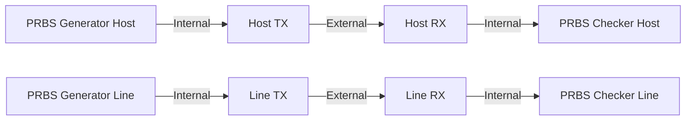
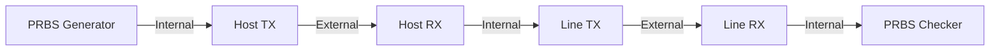
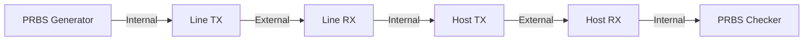
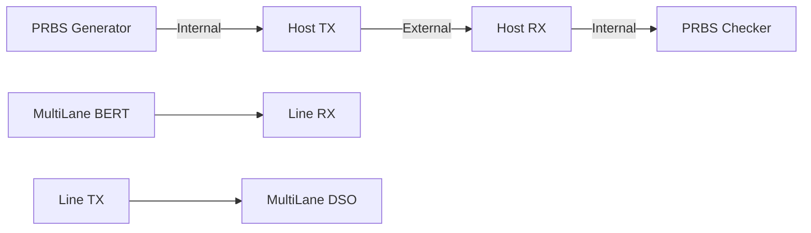
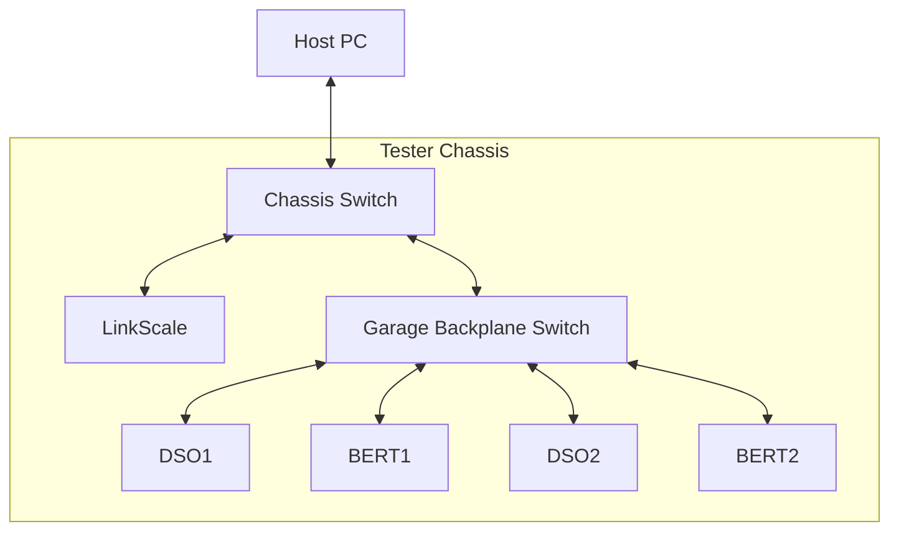
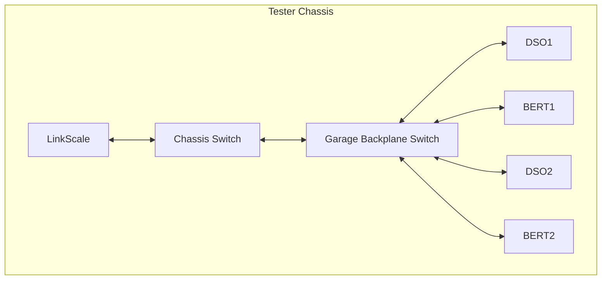

% Marvell xDSP Test List
% Stephen Peck; Kris Hublitz
% August 12, 2023

# Today's Test List

## PAM4 Without MultiLane
* Firmware Download Successful
* Setup Successful
* PRBS Lock
* PRBS LSB BER
* PRBS MSB BER
* PRBS Signal to Noise Ratio

## PAM4 With MultiLane
### Critical Metrics
* Firmware Download Successful
* Setup Successful
* SNDR - Industry Standard PAM4, NRZ uses Jitter
* Eye Height(s)
* Eye Width(s)
* RLM94
### Informational Metrics
* Eye Voltage Levels (zero, one, two and three)
* Eye Min and Max Voltage
* Peak to Peak Voltage
* Eye Base and Top
* Eye Amplitude

# Loopback Options
## Dual PRBS

## Egress or Host to Line

## Ingress or Line to Host

# Desired Support for Future Efforts

- Masking for each eye
- Offline capability with waveform playback for regression testing
- Reduction in overhead for adjusting CW Tone Output

# MultiLane Hardware Configuration

---

# Tester Network Configuration

