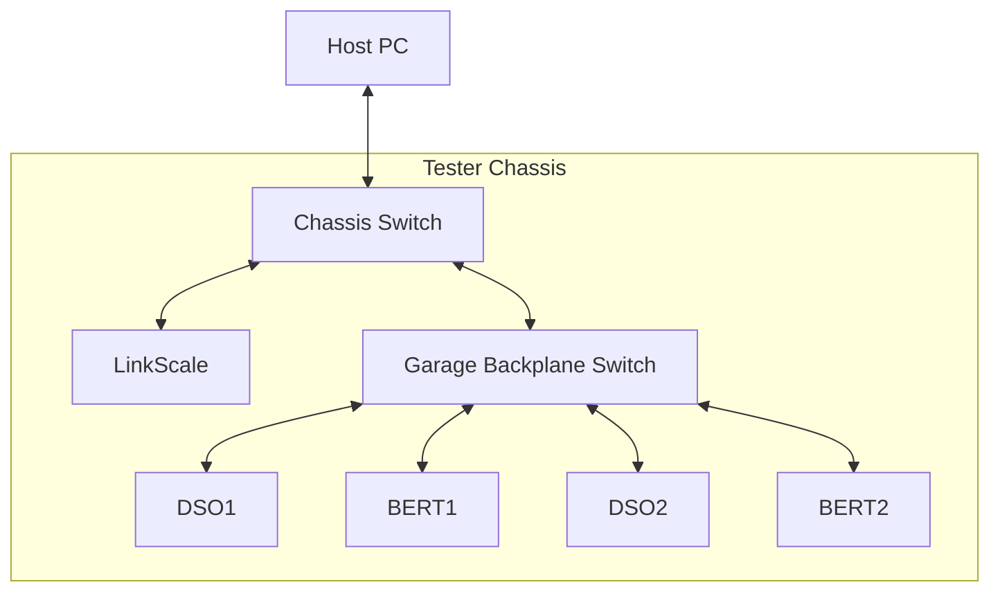
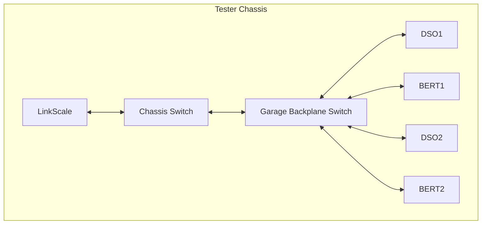

```mermaid
flowchart TD
    host[Host PC]
    subgraph Tester Chassis
        c_switch[Chassis Switch]
        LinkScale
        g_switch[Garage Backplane Switch]
        DSO1
        BERT1
        DSO2
        BERT2
    end
    host <--> c_switch
    c_switch <--> LinkScale
    c_switch <--> g_switch

    g_switch <--> DSO1
    g_switch <--> BERT1
    g_switch <--> DSO2
    g_switch <--> BERT2
```

```mermaid
flowchart TD
    subgraph Tester Chassis
        LinkScale <--> c_switch[Chassis Switch]
        c_switch <--> g_switch[Garage Backplane Switch]
        g_switch <--> DSO1
        g_switch <--> BERT1
        g_switch <--> DSO2
        g_switch <--> BERT2
    end
```